So your kid has cancer.

Well, *fuck.*

After most of the harshest emotions have passed and acceptance has set in, let's get down to work. There is a learning opportunity in everything, so let's make the best of this shit sandwich!

The doctors were confident and reassuring. This wasn't just any cancer - this was papillary thyroid cancer, which is fortunately one of the most treatable forms. The way the treatments have played out in our case included two rounds of (pretty major) surgery to remove most of the affected tissues in the neck. After that, a follow up of radioiodine therapy was used to destroy any remaining thyroid cells.

Nuclear medicine is super interesting. This is the part we will focus on here.

## Radioiodine Therapy

Thyroid cells take up iodine unlike any other tissue in the body. They concentrate and store the iodine so it can be used to manufacture thyroid hormone (thyroxines T3 and T4), which the body uses to help regulate metabolism, immune function, and other systems. The chemistry of elements is the same regardless of which isotope we are talking about, so [some clever people](https://en.wikipedia.org/wiki/Saul_Hertz) figured out that they could dose patients with radioactive iodine, which would naturally concentrate in the thyroid cells.

Ionizing radiation, like the kind produced from the decay of radioactive iodine isotopes, is harmful and can destroy tissues in the body. Because the iodine concentrates in the thyroid, mostly the thyroid cells are affected, and because they are cancerous assholes, this destruction is *exactly* what we want.

## Radiation

[Iodine-131](https://en.wikipedia.org/wiki/Iodine-131) is the isotope used to treat thyroid cancers. It has an 8-day half-life and  decays to stable Xenon while emitting beta particles at 606 [keV](https://en.wikipedia.org/wiki/Electronvolt) and gamma rays at 364 keV. Beta radiation has a penetration depth in human tissue of only a few millimeters, so very little of this should escape the patient. This form of ionizing radiation is quite damaging to the thyroid cells being targeted. The gamma rays on the other hand will escape the patient in much higher abundance.

And this, we can measure. **SCIENCE!**

## Safety

The patient is at their most radioactive for the first 7 days after the oral iodine dose. While the half-life of I131, is 8 days, it is expelled from the body through urine, which reduces the radioactivity [much faster](https://edm.bioscientifica.com/view/journals/edm/2017/1/EDM17-0111.xml). Small amounts are also excreted in saliva and sweat. During this time the patient should remain at least 3 m away from other people (and pets), have their own bathroom and dishes, drink plenty of fluids, and just generally be isolated from others. Radiation decreases with distance according to the [inverse-square law](https://en.wikipedia.org/wiki/Inverse-square_law), so at 3 m, the measurable radiation should be quite safe.

For gauging safe levels or radiation, you can use this helpful chart.

<a href="https://xkcd.com/radiation/" target="_blank">
 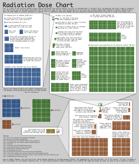
</a>

**IMPORTANT DISCLAIMER: no effort was made to calibrate this device against tested radiation safety standards. Please use this device ONLY for educational and entertainment purposes. The sensitivity of the sensor to I131 decay is not ideal, and actual radiation levels may well be much higher than the values reported. Legally, this project is made available for educational purposes only, and I absolve all responsibility for any harm caused by its use or misuse.**

## Sensor

The classic tool for measuring radiation is a [Geiger counter](https://en.wikipedia.org/wiki/Geiger_counter). These use a low pressure tube of inert gas through which a high voltage has been applied. Any ionizing radiation that enters the tube will cause the gas to briefly conduct electricity, and this is measured by the external circuitry. These tubes have become quite cheap, however they are fragile, and require high voltages for operation. While others have used [Geiger-Muller tubes](https://www.instructables.com/id/DIY-Arduino-Geiger-Counter/), or even [photo diodes](https://www.researchgate.net/publication/325685986_Implementation_Of_Wearable_Radiation_Detector) in similar projects, I opted for a simpler approach.

After the Fukushima nuclear reactor incident, the folks over at <http://www.radiation-watch.org/> developed the Pocket Geiger. This is a non-profit effort to monitor environmental radiation levels and improve public safety. They have developed a solid state sensor that is easily integrated with a microcontroller, or attached to a smartphone through the headset jack. It is widely available from online shops, such as [Digi-Key](https://www.digikey.com/products/en?keywords=pocket%20geiger) and [Sparkfun](https://www.sparkfun.com/products/14209).

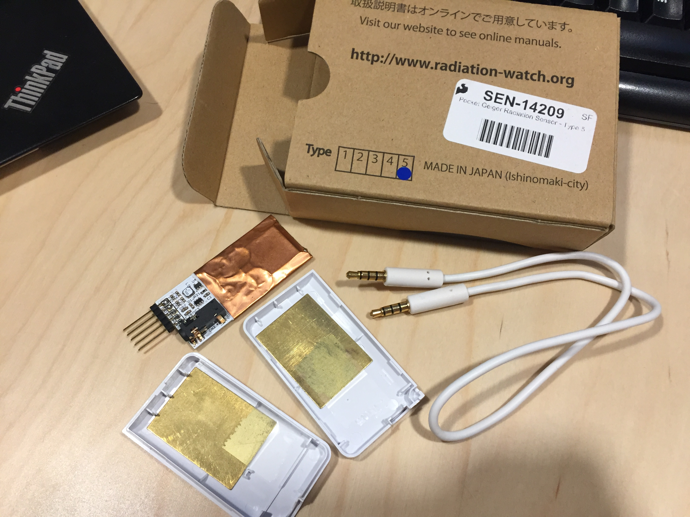

The sensor can detect both beta and gamma rays, but as noted, we do not anticipate a lot of beta radiation escaping the patient. The component [data sheet](https://cdn.sparkfun.com/assets/learn_tutorials/1/4/3/X100-7_SMD_501401.pdf) has a helpful chart illustrating the absorption probability for gamma rays of various energies. It is most effective at low energies around 8-10 keV. Unfortunately, the probability of absorption for our gamma rays will be a little less than 1%, but given the high dose, this should still work rather well for our purposes. As an aside, this absorption rate is NOT useful for measuring the naturally occurring potassium (K40) that occurs in [bananas](https://en.wikipedia.org/wiki/Banana_equivalent_dose) because that decays with gamma rays at a much higher 1.460 MeV (a fact which we were sad to confirm experimentally).

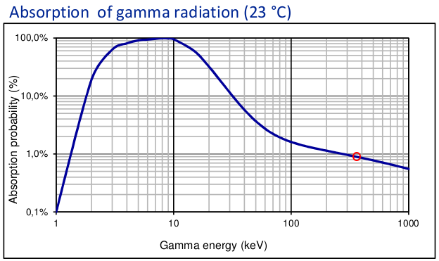

The sensor takes about 20 minutes to get an accurate reading as it integrates gamma ray energy over time. This is easily observed in the data, shown below. The warm-up period consistently shows an asymptotic increase, followed by a shorter linear increase, after which the data begins to track the actual radiation measurements. This warm-up data should be ignored, but because sensor reboots are infrequent, I have not bothered to eliminate it from the logs.

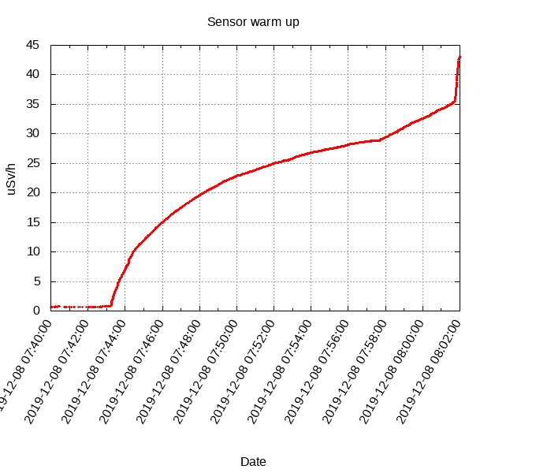

## Microcontroller

We don't want the patient to be tied down by cables, so this device needs to be wireless. That means two things: battery power and WiFi.

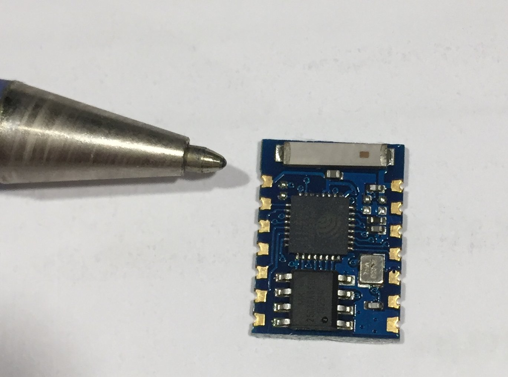

The [ESP8266](https://www.espressif.com/en/products/hardware/esp8266ex/resources) is a super cheap ($2) microcontroller which satisfies both of these requirements with ease, while still supporting the [Arduino SDK](https://www.arduino.cc/en/main/software) tool kit (a development kit that supports a wide range of microcontrollers). Plus, I had about 20 ESP8266 microcontrollers lying around waiting to be used in a project.

## Software

The software consists of several parts: the firmware running on the sensor device itself, the server collecting the data, and some post-processing scripts to generate pretty graphs. All of this code is available in this repo.

The firmware running on the ESP8266 for dealing with the sensor is pretty simple and almost exactly follows the example sketch from Radiation Watch. The [library code](https://github.com/MonsieurV/ArduinoPocketGeiger/tree/master/src) provided is designed for use with the Arduino SDK. The library works pretty much out of the box and made this project easy to cobble together with the limited time available. To use the provided library, we register callbacks for both the `noise` and `signal` pins, which just send the most recent measurement value to a MQTT broker on the local network. The bulk of the effort was actually getting the device to reliably connect to WiFi, since the ESP8266 can be quite finicky. Plenty of help on that aspect was found elsewhere on the web, as this is a popular microcontroller.

The server was even easier, as everything was already created for us. We use the Mosquitto MQTT broker available from any common Linux package manager. The sensor will publish to this broker service once we hard-code the IP address. To record the data, we just subscribe an MQTT client to all topics, and log everything to a local file (using `ts` to apply timestamps):

~~~
    mosquitto_sub -v -t \# |  ts >> datafile
~~~

This produces a log file that looks like this:

~~~
    Jan 14 09:51:57 geiger2_status geiger2 is alive!
    Jan 14 09:51:57 geiger2_status geiger2 booted!
    Jan 14 09:51:57 geiger2_status noise!
    Jan 14 09:52:41 geiger2_out 0.159399 uSv/h +/- 0.060247
    Jan 14 09:52:42 geiger2_status noise!
    Jan 14 09:52:42 geiger2_out 0.155885 uSv/h +/- 0.058919
    Jan 14 09:52:42 geiger2_out 0.177039 uSv/h +/- 0.062593
    Jan 14 09:52:42 geiger2_out 0.176487 uSv/h +/- 0.062398
    Jan 14 09:52:43 geiger2_out 0.175938 uSv/h +/- 0.062204
    Jan 14 09:52:43 geiger2_out 0.174851 uSv/h +/- 0.061819
~~~

The data file is then parsed to a CSV format and plotted with `gnuplot` (or even Excel if you wish to do it manually). Scripts for this post-processing are also available [here](https://github.com/finderoffail/radiation_sensor/tree/master/post_processing).

## Hardware

In all, 3 hardware revisions were made throughout this project.

### Version 1

This was the first prototype and was crudely slapped together on a breadboard late one night. It is conveniently powered directly from the 3 V FTDI cable that is used to program the microcontroller. It worked flawlessly, however as the patient moved around the house varying the distance between them and the sensor, the measured radiation intensity fluctuated quite a lot. A portable solution was needed.

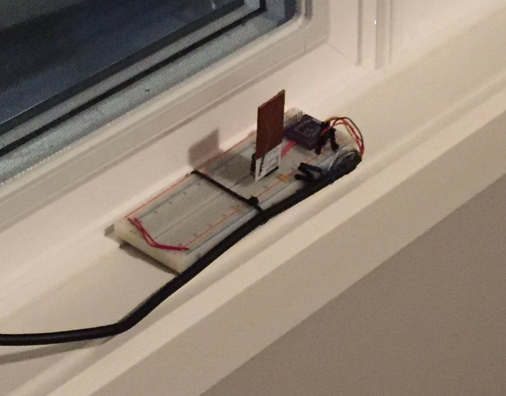

### Version 2

Because the radiation measurements fall off with the square of the distance, we will get better readings if the sensor is as close to the patient's neck as possible. This version was hastily put together by gutting a cheap book light that was on hand. It was powered directly off 2 AAA batteries, which provided power for about 9 hours without any power optimization in the software. The clip was then worn on the shirt collar. This resulted in much higher measurements, and much more consistent readings because we no longer had the pesky inverse-square law to deal with.

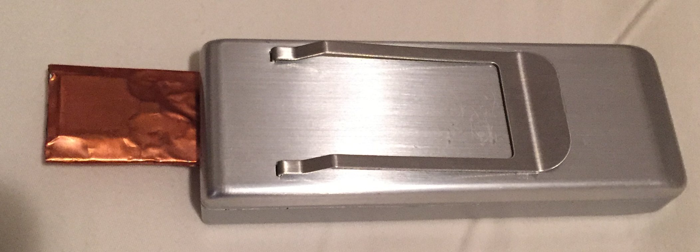

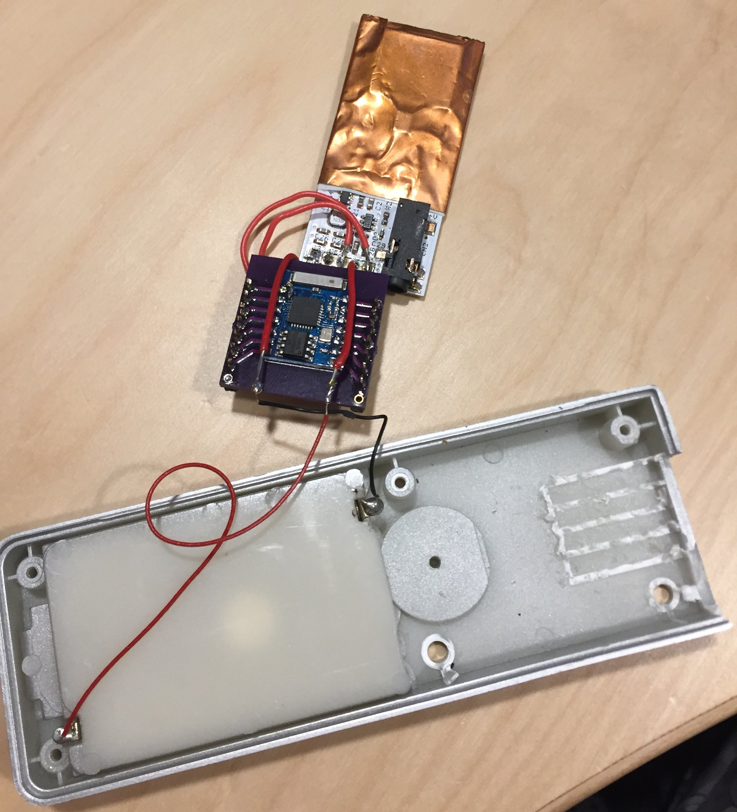

### Version 3

This is the final iteration of the device. It is powered from a 1100 mAh battery that lasts about 15 hours between charging (without any power optimizations). A small project box was used to house everything. Small holes were drilled for the charging LED (lightpipe made from hot glue) and the USB charging port. A USB charging module is included to keep the device powered, and a 3 V DC regulator was added to provide better power conditioning.

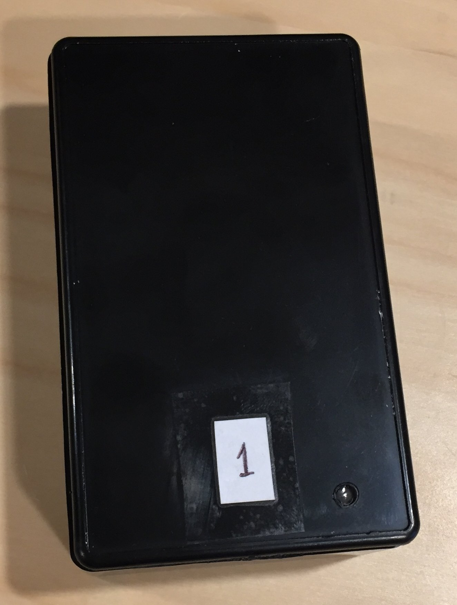 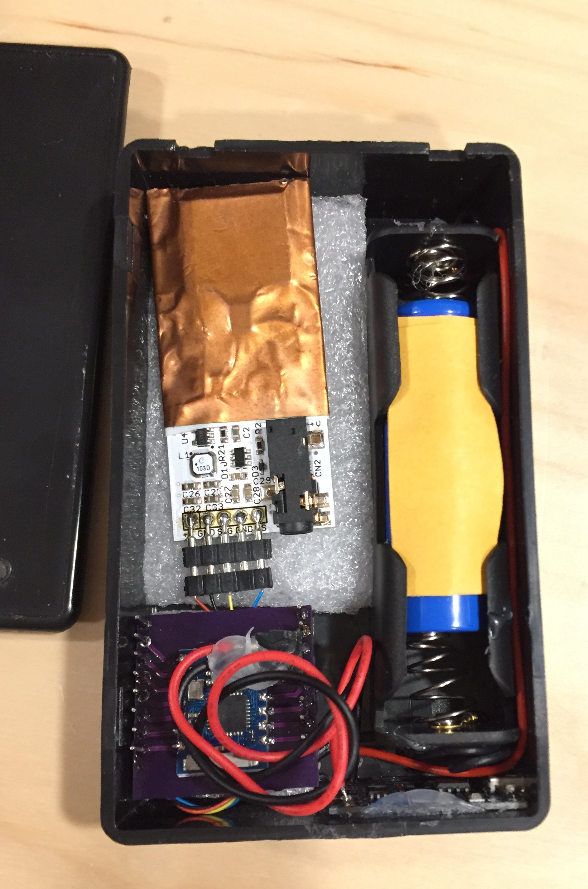

### Assembly

Putting it all together, the following connectsion need to be made:

* The battery connects to the charger module's `B+`/`B-` terminals.
* The charger module connects to the 3 V regulator: `OUT-` to `G` and `OUT+` to `Vi`.
* The 3 V regulator connects to the ESP8266: `G` to `GND` and `Vo` to `VCC`.
* ESP8266 (using the breakout) connect: `GND` to `GPIO15`, `VCC` to `CH_PD` and `GPIO2`.
* ESP8266 connects to the PocketGeiger sensor: `GPIO12` to `signal`, `GPIO13` to `noise`, `GND` to `GND`, `VCC` to `+V`.

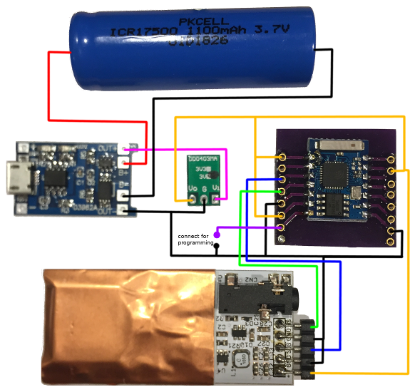

To program, pull `GPIO0` to `GND` during boot to access the ESP8266 bootloader for programming (release this for normal operations).

The charging module and battery are held in place with hot glue. Drill some small holes and clean it up with a sharp knife to get a nice solid USB charging port. I also drilled a small hole near the charging module LED and filled it with hot glue to make a simple light pipe.

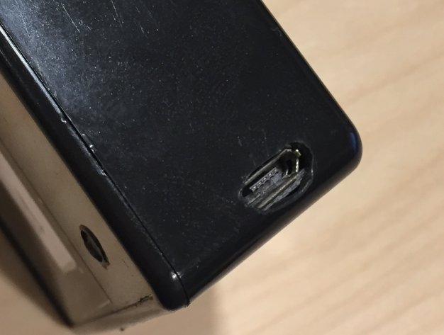 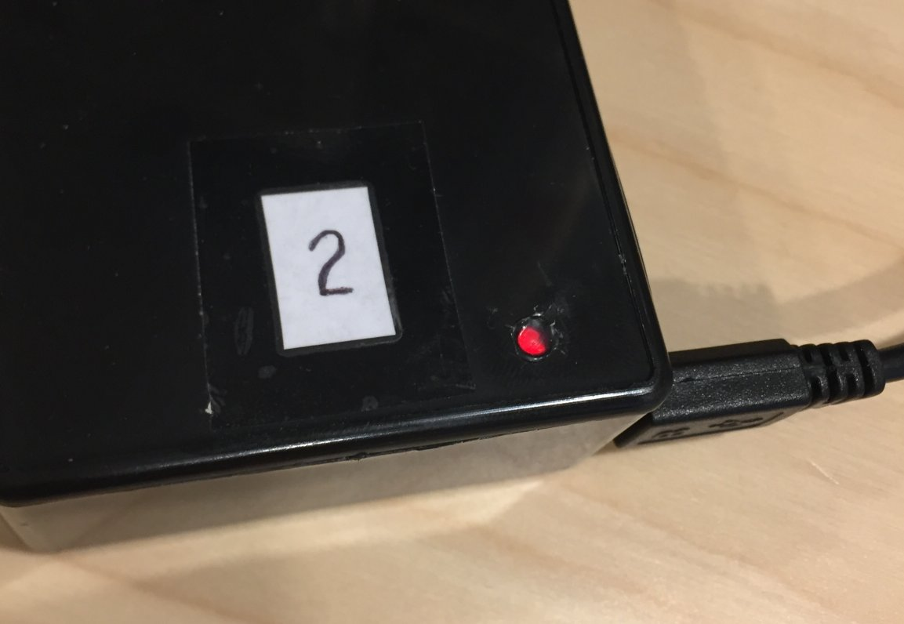

Once it is all working, jam it all in the box. I used a bit of foam to keep it from bouncing around too much as vibrations will cause the noice pin to trigger.

Close it up, you are done!

#### Bill of Materials
* [Cheap plastic project box](https://www.amazon.ca/gp/product/B019GFLNV4/ref=ppx_yo_dt_b_asin_title_o08_s00?ie=UTF8&psc=1)
* [TP4056 Lithium Battery Charger Module](https://www.amazon.ca/gp/product/B06XNXHY6W/ref=ppx_yo_dt_b_asin_title_o08_s01?ie=UTF8&psc=1)
* [17500 1100mAh lithium-ion battery](https://www.amazon.ca/gp/product/B0796PNB96/ref=ppx_yo_dt_b_asin_title_o08_s00?ie=UTF8&psc=1)
* [Battery holder](https://www.amazon.ca/gp/product/B075V1TYCX/ref=ppx_yo_dt_b_asin_title_o08_s00?ie=UTF8&psc=1) (in my haste I ordered a holder for 18650 which is too big so I added a second spring from another holder to make it work)
* [3v regulator](https://www.amazon.ca/gp/product/B07RGNWMT6/ref=ppx_yo_dt_b_asin_title_o07_s00?ie=UTF8&psc=1) (this is not actually needed since everything operates just fine powered directly from the 3.7v battery)
* [Pocket Geiger radiation sensor (type 5)](https://www.digikey.com/catalog/es/partgroup/pocket-geiger-radiation-sensor-type-5/68635)
* [ESP8266 ESP03](https://www.ebay.com/itm/202173547622)
* [ESP8266 ESP03 breakout adapter](https://oshpark.com/shared_projects/MCPAPDAv)
* [FTDI Cable](https://www.digikey.ca/product-detail/en/ftdi-future-technology-devices-international-ltd/C232HM-DDHSL-0/768-1106-ND/2714139) used only for programming

## Data!

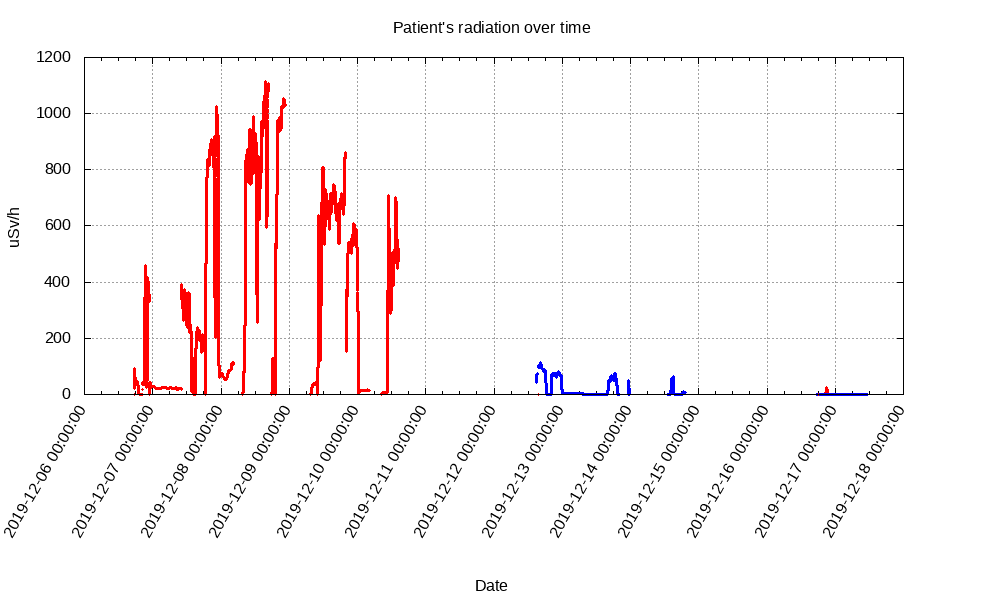

Once the *version 1* device was turned on, it immediately started reading elevated radiation levels at approximately 2 m away from the patient. For reference, normal background radiation measures about 0.05 uSv/h.

Moving the sensor to the table beside the kiddo's chair (30cm) caused the readings to go up to almost 500 uSv/h. Some experiments with distance to demonstrate the inverse-square law were also done for fun. Low readings were captured during the night from the window ledge near the bed (~2 m).

The next day, more readings from beside the patient were captured. Large reductions were measured during periods when the kid was not close enough to get a good reading, and this reinforced the idea of making the device battery powered and led to the *version 2* design. The rest of the red data (at about 800-1100 uSv/h) was captured with this portable hardware. Note that the AAA batteries died every 9 hours or so.

There is a distinct reduction in radiation levels day after day as the I131 is expelled from the body. The 3-day break in the data occurred because we ran out of batteries to replace the dead ones, and during this time, parts were ordered to build the *version 3* device.

The blue data (and the small red blip the evening of Dec 16) was captured with the latest hardware version. We can see that the downward trend in emissions continued, almost exactly on schedule from what was expected.

## Epilogue

The kid, with everything else they were going through and generally just being a young teenager, didn't want anything to do with this experiment at first. That attitude quickly changed once we were able to see real-time data.

That spark of interest made this project all worthwhile.

There was some real learning about biology, nuclear medicine, radiation, electronics, and data analysis. It was Grandma's insistence that other kids going through similar treatment might enjoy this project, and that directly led to the final hardware improvements (*thanks mom!*).

This is why I have published this post. If you do attempt to reproduce this, please [drop me a line](mailto:finderoffail@dobber.ca) ([@finderoffail](https://twitter.com/finderoffail)).

Most of all, I want to thank all the fabulous staff and volunteers at [Sick Kids Hospital](https://www.sickkids.ca) in Toronto. While they had no direct involvement with this project, they were directly responsible for the world class treatment and care that our kid received, and for the speedy recovery. Truly, they have the best people working there and we are all super grateful.

## Future Work

No project is ever really finished. As the project progressed, the following additional ideas for improvement were considered (and may yet be implemented).

In no particular order:

1. Create some sort of web site that can collect and display the data. If this turns out to be a widely used project, then others might appreciate this "ease of use" when they are otherwise occupied with care of the patient.
1. Waterproofing: the project box used in the *version 3* design was described as waterproof, but this was unfortunately not true. Adding water-tight seals would make the device less vulnerable to showers, rain, sweat, and spills. A water-tight USB connector [like this](https://www.digikey.ca/product-detail/en/edac-inc/690-W05-290-483/151-1244-1-ND/4990932) would be useful.
1. Battery reporting: currently there is no way to know what the battery level is, aside from opening the device and using a multimeter. The ESP8266 [TOUT/PIN6](https://microcontrollerslab.com/esp8266-pinout-reference-gpio-pins/) has an ADC that can be used for this ([tutorial](https://randomnerdtutorials.com/esp8266-adc-reading-analog-values-with-nodemcu/)).
1. Improvements to battery life. There was very little effort spent on reducing power consumption. Nevertheless, the *version 2* device ran for ~9h on 2 AAA batteries, and *version 3* for 15h. This could be greatly improved by using the ESP8266 deep sleep mode. We would need to save the integration data and interrupt counters to the RTC RAM, and maybe use the sensor sign/noise signals to wake up the microcontroller. Additionally, reducing the communication frequency would have a significant power savings.
1. Add TLS. Currently this project has no network communications security, which makes it insecure to use anywhere but an isolated WiFi network. This also gives me some anxiety, given that security is my day job ([example implementation](https://internetofhomethings.com/homethings/?p=1820)).
1. Use a public MQTT broker such as [HiveMQ](https://www.hivemq.com/public-mqtt-broker/). This would eliminate the dependency on local MQTT software, make sharing data much easier, and allow easier movement between locations. TLS is certainly needed before this can happen.
1. Improve WiFi credential management. Network credentials are currently hard-coded in the firmware, and changing these requires reprogramming, which is inconvenient. Using the [WiFiManager](https://github.com/tzapu/WiFiManager) package would make this much easier to configure.
1. Investigate the use of a cheap cellular module. This would allow the device to operate without being on the home WiFi, which is rather limiting if the patient is spending time in multiple places (in our case, isolation at Grandma's house was easiest).
1. Add an audible clicking sound when each gamma ray is detected. This would make the device behave more like the geiger counters in the movies, and might be a fun (though annoying?) extension, in particular for younger patients ([example implementation](http://www.areresearch.net/2015/04/esp8266-esp-01-nodemcu-playing-imperial.html)).
1. Add [OpenLog](https://www.sparkfun.com/products/13712) support. This would allow the data to be logged locally to a uSD card which can help in cases of limited or poor network connectivity.
1. The programming process could be improved by connecting a reset signal, and by controlling the programming mode pull-down through the FTDI cable. This would reduce the need for manual intervention during repeated programming. This was only a minor inconvenience during the firmware development.

